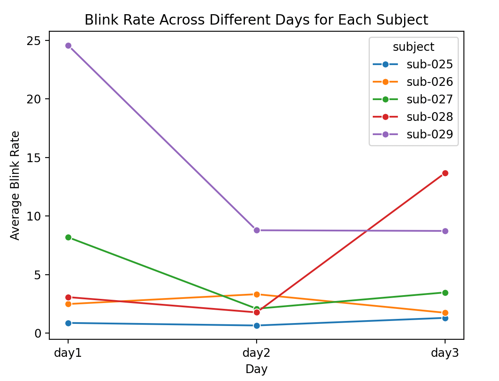
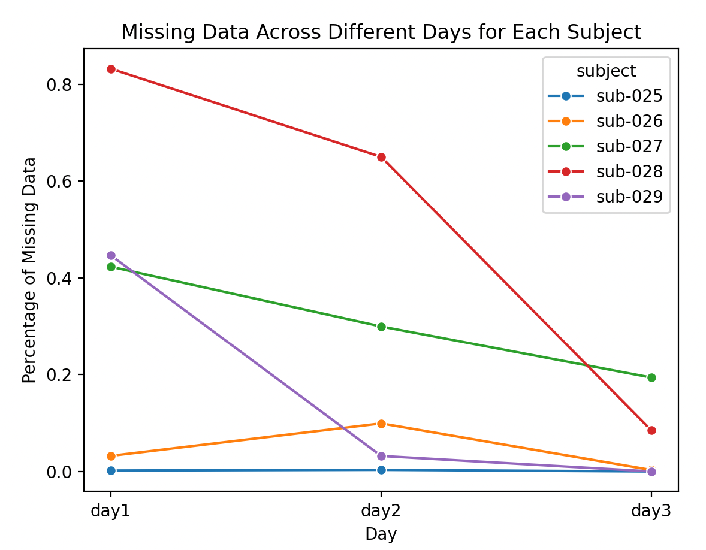
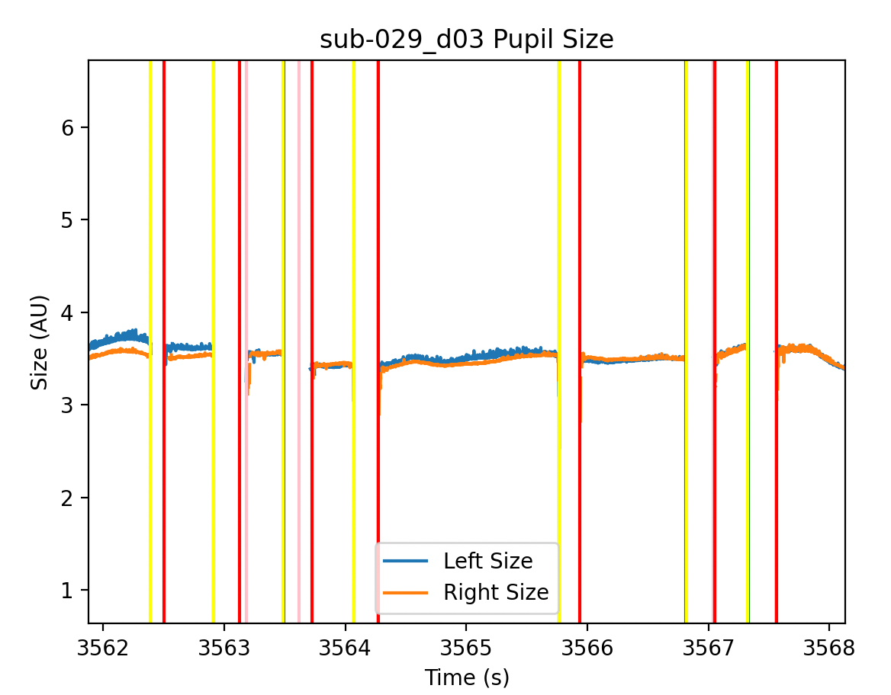

# Introduction
The purpose of this project is to develop a package (blinkdetection) that uses an algorithm for blink detection to be used for the analysis of 
data from eye trackers such as Tobii products.

Data from any eyetracker can be analyzed using the scripts in this repository, however, the algorithm was built 
for Tobii products specifically, so be advised that different brands of eyetrackers have different noise
patterns. 

## Cloning the repository
To run this program, enter the following in your command prompt
```commandline
git clone https://github.com/andreac0ntreras/Blink-Detection-Algorithm.git
```

### Navigate to the codebase
Move into the project directory
```commandline
cd ./Blink-Detection-Algorithm
```

### Install the required packages
```commandline
pip install -r requirements.txt
```

The required packages for the program include:
```doctest
numpy==1.26.4
pandas==2.2.2
matplotlib==3.8.4
pyxdf
plotly
statsmodels
seaborn
```

## Sourcing
Within the project directory, there are three directories. The data directory (_data/raw/XDF Files_) contains the raw data from the
OWDM experiment, which we will be analyzing. The raw data is in the form of XDF files, where one of the streams 
contains the eye tracker timeseries data and the eyetracker specs. To extract the relevant eyetracker information from the XDF files
(**timestamps, left_pupil_size, and right_pupil_size**), run the following line of code in the main.py file.
```doctest
# Define folder paths
folder_path = 'data/raw/XDF Files'
interim_folder = 'output/interim'

# Process the XDF files
bd.process_xdf_files(folder_path, interim_folder)
```

This line of code uses functions from the sourcing folder in the blinkdetection package to convert the raw XDF Files to interim CSV files 
that contain the relevant variables

## Blink Detection and Processing
After generating an interim CSV file containing the pupil sizes and timestamps for each day and participant, 
we can now implement our blink detection algorithm. 

The interim CSV files containing the pupil sizes and timestamps for each day and subject are located in the _output/interim/_ directory

By running the following line in the main.py file,
an output CSV file called _compiled_feature_extraction.csv_ is generated (in the _output/features_ directory) 
with columns subject, day, left_blink_onsets, left_blink_offsets, right_blink_onsets, right_blink_offsets, and many
other features in generated

```doctest
compiled_df = bd.process_csv_files(interim_folder)
```

## Plotting
Finally, using the CSV files generated by 
```doctest
bd.process_xdf_files(folder_path, interim_folder)
```

we can create graphs that plot time against pupil size for each day for each participant. 
Once you run the following line of code in main.py, one plot for each day for each participant will be generated in
the directory (_output/plots_). In addition to the lines that show the trend of left and right pupil size 
against time, there will be horizontal pink, green, red, and yellow lines, where the green represents times at which the blink detection algorithm recognized 
a left eye blink onset, pink represents times at which the blink detection algorithm recognized a left eye blink offset, yellow represents 
times at which the blink detection algorithm recognized a right eye blink onset, and red represents 
times at which the blink detection algorithm recognized a right eye blink offset.
```doctest
bd.plot_all_time_v_pupil_size_csv_files_in_directory(interim_folder, show=True)
```

## Remainder of Main
The remainder of main is experimental code that does an ANOVA test to see if there are consistent differences among blink 
rates across the three days for the participants, the code also generates graphs like the following:


Using this line of code 
```doctest
bd.plot_feature_over_three_days(compiled_df, show=True)
```

## Gallery
Here is an example of a zoomed in plot outcome:


## Specifications
The hardware used during this experiment is the Tobii Spectrum Pro with a sampling frequency of 600Hz.

